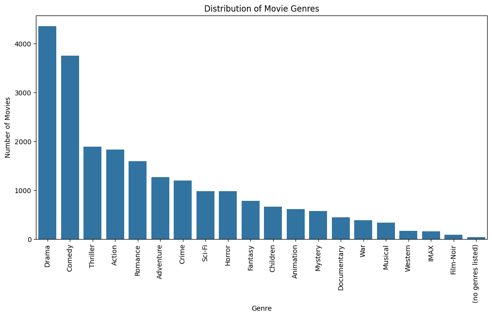
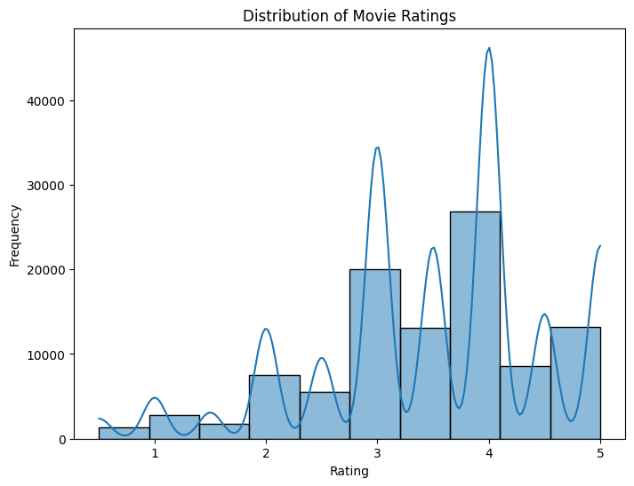

# Laporan Proyek Machine Learning - I Gusti Bagus Ramadha Saverian Ranuh

## Project Overview

### Latar Belakang:

Dalam era digital yang semakin maju, jumlah konten film dan media yang tersedia di berbagai platform terus meningkat secara eksponensial. Platform streaming seperti Netflix, Disney+, dan Amazon Prime menghadapi tantangan besar dalam membantu pengguna menemukan film yang relevan dengan preferensi mereka. Hal ini menciptakan kebutuhan mendesak untuk membangun sistem rekomendasi yang efektif dan sesuai dengan kebutuhan user.

Sistem rekomendasi memainkan peran penting dalam meningkatkan user experience dengan menyaring informasi yang berlebihan dan menyajikan konten yang sesuai dengan minat individu. Pendekatan seperti Collaborative Filtering, Content-Based Filtering, dan model berbasis Neural Network telah menjadi landasan dalam pengembangan teknologi ini. Dengan menggunakan data yang tersedia secara publik, seperti metadata film dari TMDB dan dataset MovieLens, sistem rekomendasi dapat dirancang untuk memahami preferensi pengguna secara lebih mendalam.

Proyek "Movie Reccomender" ini penting untuk diselesaikan karena beberapa alasan berikut:

1. Peningkatan User Experience: Sistem rekomendasi yang akurat membantu pengguna menemukan konten yang sesuai dengan preferensi mereka tanpa harus mencarinya secara manual, yang dapat meningkatkan kepuasan pelanggan.

2. Efisiensi Operasional Platform: Dengan merekomendasikan konten yang relevan, platform dapat mengurangi waktu pencarian user, meningkatkan keterlibatan, dan mendorong retensi user atas aplikasi yang digunakan.

3. Manfaat Bisnis: Dari sisi bisnis, sistem rekomendasi yang baik dapat meningkatkan jumlah user, memperpanjang waktu tonton, dan membuka peluang untuk monetisasi lebih lanjut, seperti iklan berbasis preferensi.

Referensi:

- [Movie Recommender System Using Collaborative Filtering](10.1109/ICESC48915.2020.9155879)
- [Movie Recommendation System Based on Synopsis Using Content-Based Filtering with TF-IDF and Cosine Similarity](https://doi.org/10.21108/ijoict.v9i2.747)
- [Movie Recommendation System Using Deep Autoencoder](10.1109/ICECA52323.2021.9675960)

## Business Understanding

### Problem Statements

1. Kesulitan memahami preferensi user berdasarkan pola perilaku mereka yang menyebabkan sistem rekomendasi film tidak memberikan hasil yang relevan.

2. Ketidaksesuaian antara film yang direkomendasikan dan preferensi user sering terjadi karena sistem rekomendasi belum memanfaatkan atribut film secara optimal.

3. Akurasi sistem rekomendasi masih rendah karena belum memanfaatkan potensi model Neural Network untuk menangkap pola kompleks dalam data user dan atribut film.

### Goals

1. Membangun model Collaborative Filtering menggunakan teknik seperti Single Value Decomposition (SVD).

2. Mengembangkan sistem Content-Based Filtering menggunakan pendekatan seperti CountVectorizer untuk ekstraksi fitur.

3. Mengimplementasikan Neural Network untuk sistem rekomendasi yang mampu menangkap hubungan non-linear antara pengguna dan item dengan lebih kompleks.

### Solution Approach

#### Solution Statements

- Content-Based Filtering: Pendekatan ini menggunakan atribut atau metadata dari item (misalnya, genre, sutradara, atau aktor dalam film) untuk merekomendasikan konten yang mirip dengan preferensi pengguna. Studi oleh [Lops et al., 2011](10.1007/978-0-387-85820-3_3) menekankan pentingnya ekstraksi fitur dalam menciptakan model berbasis konten yang akurat.

Menggunakan CountVectorizer untuk menganalisis atribut seperti genre, sinopsis, dan pemeran dalam film untuk menghasilkan rekomendasi yang relevan. 

- Collaborative Filtering: Collaborative Filtering adalah pendekatan yang memanfaatkan interaksi pengguna dengan konten (seperti rating atau ulasan) untuk merekomendasikan item. Penelitian oleh [Sarwar et al., 2001](10.1145/371920.372071) menunjukkan bahwa metode ini sangat efektif untuk menangkap pola preferensi pengguna berdasarkan kesamaan perilaku dengan pengguna lain. 

Collaborative Filtering mengimplementasikan Single Value Decomposition (SVD) untuk memanfaatkan pola rating dari pengguna lain yang serupa.

- Neural Network for Recommendation System: Neural Networks telah menjadi pendekatan mutakhir dalam sistem rekomendasi, melalui model autoencoder. Model ini memanfaatkan representasi laten untuk menangkap hubungan non-linear antara pengguna dan item, yang sering kali lebih sulit ditangkap oleh metode tradisional.

Membangun model berbasis Neural Collaborative Filtering (NCF) untuk menangkap pola interaksi yang lebih kompleks antara pengguna dan film.


Untuk mencapai tujuan di atas, berikut implementasi yang diajukan:

1. Eksperimen dengan Beberapa Teknik Rekomendasi

Sistem rekomendasi dikembangkan menggunakan tiga pendekatan:

- Content-Based Filtering:
Menggunakan atribut seperti genres, cast, keywords, dan crew untuk membuat profil film dan menghitung kemiripan menggunakan cosine similarity.
Pendekatan ini memungkinkan rekomendasi berdasarkan konten film yang mirip.

- Collaborative Filtering:
Menggunakan pendekatan matriks utilitas (pivot) antara userId dan movieId dengan nilai rating.
Menerapkan dekomposisi nilai singular (SVD) untuk merekonstruksi matriks dengan dimensi yang lebih kecil.
RMSE digunakan sebagai metrik evaluasi untuk mengukur akurasi prediksi.

- Neural Network-based Autoencoder:
Dibangun autoencoder untuk menemukan representasi laten dari interaksi pengguna dan film.
Memanfaatkan dense layers untuk merekonstruksi matriks pengguna-film, memberikan prediksi skor untuk film yang belum ditonton.

2. Peningkatan Model dan Evaluasi

- Content-Based Filtering:
Pendekatan ini menggunakan CountVectorizer untuk mengekstrak fitur teks dan menghasilkan matriks kemiripan.
Evaluasi dilakukan dengan memeriksa rekomendasi film untuk judul tertentu, seperti "The Dark Knight Rises."

- Collaborative Filtering:
Model SVD dilatih menggunakan validasi silang (KFold) untuk meningkatkan generalisasi.
RMSE dihitung untuk setiap lipatan guna memastikan model menghasilkan prediksi yang akurat.

- Neural Network-based Autoencoder:
Model dilatih menggunakan fungsi kerugian binary_crossentropy dan dioptimalkan dengan Adam.
Validasi dilakukan pada data uji untuk menghindari overfitting.

3. Evaluasi dan Perbandingan

- Content-Based Filtering:
Direkomendasikan untuk pengguna baru (cold-start) yang belum memiliki riwayat interaksi, karena hanya memerlukan data film.

- Collaborative Filtering:
Cocok untuk pengguna dengan riwayat interaksi yang cukup, karena memanfaatkan data pengguna lainnya untuk prediksi.

- Neural Network-based Autoencoder:
Memberikan hasil terbaik untuk dataset besar dengan pola kompleks, karena memanfaatkan representasi laten dari data.

4. Analisis Hasil

- Rekomendasi dihasilkan untuk pengguna tertentu (ex: user_id = 28) menggunakan setiap pendekatan.

- Sistem dapat diadaptasi untuk berbagai kebutuhan, seperti menambahkan metrik evaluasi atau atribut baru untuk meningkatkan akurasi rekomendasi. 

## Data Understanding

### Informasi Dataset
**MovieLens Small Latest Dataset**  

1. **URL / Tautan Sumber Data:** Gabungan dataset [MovieLens Movie Dataset on Kaggle](https://www.kaggle.com/datasets/shubhammehta21/movie-lens-small-latest-dataset?select=movies.csv) dan dataset ratings [MovieLens Rating Dataset on Kaggle](https://www.kaggle.com/datasets/shubhammehta21/movie-lens-small-latest-dataset?select=ratings.csv)  
**Deskripsi:**  Gabungan dataset ini mencakup informasi tentang pengguna, film, dan rating yang diberikan. Data ini menjadi dasar untuk collaborative filtering, content based filtering, dan neural network reccomendation system.

2. **Jumlah Baris dan Kolom:** Gabungan dataset berisi 100836 baris dan 4 kolom, berisi 100836 rating dari 610 user terhadap 9742 film.  

3. **Kondisi Data:** Tidak ada missing values pada kedua dataset dan juga gabungan dataset. Tidak ada duplikat pada semua dataset.Hanya ada sedikit outlier pada dataset pada z-score < 2.

4. **Uraian Seluruh Fitur pada Data** 

**Rating MovieLens Small Latest Dataset**
| **Nama Fitur** | **Deskripsi**                                                     | **Tipe Data**     |
|----------------|-------------------------------------------------------------------|-------------------|
| **userId**     | ID unik pengguna yang memberikan rating.                          | Numerik           |
| **movieId**    | ID unik untuk film yang diberi rating.                            | Numerik           |
| **rating**     | Skor rating yang diberikan oleh pengguna (rentang 0.5–5.0).       | Numerik (Float)   |
| **timestamp**  | Waktu (dalam detik Unix) saat rating diberikan.                   | Numerik           | 

**Movie MovieLens Small Latest Dataset**
| **Nama Fitur** | **Deskripsi**                                                     | **Tipe Data**     |
|----------------|-------------------------------------------------------------------|-------------------|
| **movieId**    | ID unik untuk film yang diberi rating.                            | Numerik           |
| **title**      | Judul dari movie yang tertera pada movieId.                       | Numerik (Float)   |
| **Genre**      | Genre dari movie tersebut (genre bisa berjumlah lebih dari 1)     | Numerik           | 

**Gabungan MovieLens Small Latest Dataset**
| **Nama Fitur** | **Deskripsi**                                                     | **Tipe Data**     |
|----------------|-------------------------------------------------------------------|-------------------|
| **userId**     | ID unik pengguna yang memberikan rating.                          | Numerik           |
| **movieId**    | ID unik untuk film yang diberi rating.                            | Numerik           |
| **rating**     | Skor rating yang diberikan oleh pengguna (rentang 0.5–5.0).       | Numerik (Float)   |
| **title**      | Judul dari movie yang tertera pada movieId.                       | String            |
| **timestamp**  | Waktu (dalam detik Unix) saat rating diberikan.                   | Numerik           | 
| **Genre**      | Genre dari movie tersebut (genre bisa berjumlah lebih dari 1)     | Numerik           | 

### Visualisasi dan Eksplorasi Data (EDA)

1. **Top 10 Most Watched Genre**  

   

   - *Tujuan:* Menganalisis genre mana yang paling banyak ditonton oleh user. 
   - *Insight:* Genre ter-favorit nomor pertama adalah Drama, dilanjutkan oleh komedi di nomor kedua dan thriller di nomor ketiga serta action dan romance di nomor keempat dan kelima.   

2. **Distribusti Rating**  

  

   - *Tujuan:* Menganalisis rata-rata jumlah rating yang diberikan oleh user kepada suatu film.  
   - *Insight:* Sebagian besar user memberikan rata-rata rating di kisaran 3-4 untuk film yang mereka tonton. Namun, terdapat beberapa film yang memiliki nilai rating sangat rendah (di bawah 2) atau sangat tinggi (di atas 4.5), yang menunjukkan keberagaman selera user terhadap film.

3. **Distribusi Rating per User (User Activity Distribution)** 

   "Text to show on mouseover")

   - *Tujuan:* Mengetahui sebaran jumlah film yang dirating oleh setiap user, misalnya UserID1 memberikan rating kepada 10 film, sedangkan UserID23 hanya memberikan rating pada 4 film.
   - *Insight:*  Mayoritas user hanya memberikan rating pada 1-10 film. Namun, terdapat beberapa user yang sangat aktif, memberikan rating kepada lebih dari 50 film. Aktivitas user yang tinggi ini dapat menjadi sumber data yang penting untuk memahami preferensi mereka dan mengoptimalkan sistem rekomendasi. 

## Data Preparation

Pada tahap ini, dilakukan persiapan data untuk memastikan data dalam format yang sesuai dan siap digunakan untuk pemodelan. Langkah-langkah data preparation dijelaskan secara rinci berikut ini:

---

#### **1. Merging dan Picking Data Relevant**
- **Proses:** 
  - Menggabungkan dataset `movies` dan `ratings` berdasarkan kolom id untuk menggabungkan informasi film dengan data kreditnya.
  - Memilih subset kolom yang relevan seperti `id, original_title, overview, genres, cast, keywords, dan crew` dari dataset movies.
- **Alasan:** 
  - Menggabungkan data terkait dalam satu tabel untuk mempermudah analisis. 
  - Fokus pada kolom yang akan digunakan dalam analisis atau rekomendasi.

- **Kode:**
```python
movies = pd.read_csv('tmdb_5000_movies.csv')
credits = pd.read_csv('tmdb_5000_credits.csv')
```

---

#### **2. Mengecek Missing Value**
- **Proses:**   
  - Mengecek apakah ada missing value. Pada dataset yang digunakan, tidak ada missing value.
- **Alasan:**  
  - Menghindari data menjadi garbage yang bisa mengganggu analisis
- **Kode:**
```python
movie_ratings.isna().sum()
```

---

#### **3. Mengecek data duplikat**
- **Proses:**    
  - Mengecek apakah ada data duplikat. Pada dataset yang digunakan, tidak ada data duplikat.
- **Alasan:**  
  - Menghindari data yang redundan yang bisa mengganggu analisis atau model.
- **Kode:**
```python
movie_ratings.duplicated().sum()
```

---

#### **4. Mengecek outlier data**
- **Proses:**    
  - Mengecek apakah ada data outlier.
- **Alasan:**  
  - menganalisis data dengan tepat guna menentukan outlier mana yang mewakili titik data yang valid (dan harus dipertahankan), dan outlier mana yang kemungkinan besar mewakili kesalahan, dan harus dihapus dari kumpulan data.
- **Kode:**
```python
Q1 = movie_ratings['rating'].quantile(0.25)
Q3 = movie_ratings['rating'].quantile(0.75)
IQR = Q3 - Q1
lower_bound = Q1 - 1.5 * IQR
upper_bound = Q3 + 1.5 * IQR

outliers = movie_ratings[(movie_ratings['rating'] < lower_bound) | (movie_ratings['rating'] > upper_bound)]
```

---


**Content-Based Filtering**

#### **1. Mengonversi kolom teks ke format yang Terstukrur**
- **Proses:**    
  - Menggunakan fungsi `convert_text` untuk mengubah data dalam kolom `genres` dan `keywords` menjadi list yang berisi nama-nama genre atau kata kunci.
- **Alasan:**  
  - Menghindari data yang redundan yang bisa mengganggu analisis atau model.
  - Memudahkan pemrosesan data teks untuk analisis lebih lanjut.
- **Kode:**
```python

def convert_text(text):
    if isinstance(text, str): 
        L = []
        for i in text.split('|'): 
            L.append(i) 
        return L
    else:
        return []

movies_cb_filtering['genres'] = movies_cb_filtering['genres'].apply(convert_text)
```

---


#### **2. Membersihkan Teks**
- **Proses:**  
  - Menggunakan fungsi `clean_text` untuk membersihkan teks dengan mengubahnya menjadi huruf kecil dan menghapus spasi. 
- **Alasan:**  
  - Menjamin konsistensi data teks yang akan digunakan dalam analisis atau model.
- **Kode:**
```python

def clean_text(x):
    if isinstance(x, list):
        return [str.lower(i.replace(" ", "")) for i in x]

    else:
        if isinstance(x, str):
            return str.lower(x.replace(" ", ""))

        else:
            return ''

features = ['title','genres']

for feature in features:
    movies_cb_filtering[feature] = movies_cb_filtering[feature].apply(clean_text)
```

---


#### **3. Membuat Soup**
- **Proses:**  
  - Menggunakan fungsi `clean_text` untuk membersihkan teks dengan mengubahnya menjadi huruf kecil dan menghapus spasi. 
- **Alasan:**  
  - Menjamin konsistensi data teks yang akan digunakan dalam analisis atau model.
- **Kode:**
```python
def create_soup(x):
    return x['title'] + ' ' + ' '.join(x['genres'])

movies_cb_filtering['soup'] = movies_cb_filtering.apply(create_soup, axis=1)
```

---

#### **4. Melakukan Count Vectorizer**
- **Proses:**  
  - Menggunakan fungsi `clean_text` untuk membersihkan teks dengan mengubahnya menjadi huruf kecil dan menghapus spasi. 
- **Alasan:**  
  - Menjamin konsistensi data teks yang akan digunakan dalam analisis atau model.
- **Kode:**
```python
count = CountVectorizer(stop_words='english')
count_matrix = count.fit_transform(movies_cb_filtering['soup'])
```

---

#### **5. Melakukan Cosine Similarity**
- **Proses:**  
  - Menggunakan fungsi `clean_text` untuk membersihkan teks dengan mengubahnya menjadi huruf kecil dan menghapus spasi. 
- **Alasan:**  
  - Menjamin konsistensi data teks yang akan digunakan dalam analisis atau model.
- **Kode:**
```python
cosine_sim = cosine_similarity(count_matrix, count_matrix)
```

---

#### **6. Melakukan Normalisasi Data Cosine Similarity**
- **Proses:**  
  - Menggunakan fungsi `clean_text` untuk membersihkan teks dengan mengubahnya menjadi huruf kecil dan menghapus spasi. 
- **Alasan:**  
  - Menjamin konsistensi data teks yang akan digunakan dalam analisis atau model.
- **Kode:**
```python
scaler = MinMaxScaler()
cosine_sim_normalized = scaler.fit_transform(cosine_sim)
```

---

**Collaborative Filtering**

#### **1. Membagi Data dengan K-Fold Cross Validation**
- **Proses:**  
  - Menggunakan KFold untuk membagi data menjadi 5 bagian (5-fold cross-validation), yang akan membantu dalam mengevaluasi model secara lebih akurat. 
- **Alasan:**  
  - Menggunakan cross-validation untuk menghindari overfitting dan untuk menilai kinerja model dengan data yang berbeda pada setiap iterasi.
- **Kode:**
```python
kf = KFold(n_splits=5)
```

---

#### **2. Membuat Fungsi untuk Prediksi Rating**
- **Proses:**  
  - Fungsi predict_rating digunakan untuk memprediksi rating film yang belum diberi rating oleh pengguna, dengan menggunakan hasil rekonstruksi matriks dekomposisi.
- **Alasan:**  
  - Memungkinkan sistem untuk memberikan prediksi yang sesuai berdasarkan pola yang ditemukan dalam matriks dekomposisi.
- **Kode:**
```python
def predict_rating(userId, movieId, R, reconstructed):
    if userId in R.index and movieId in R.columns:
        row = R.index.get_loc(userId)
        col = R.columns.get_loc(movieId)
        return reconstructed[row, col]
    return np.mean(R.values)
```

---

#### **3.  Membagi Data Menjadi Data train dan Data test**
- **Proses:**  
  - Data dibagi menjadi data latih (R_train) dan data uji (R_test) menggunakan KFold.split(). Matriks rating dilatih dengan Singular Value Decomposition (SVD) menggunakan fungsi svds untuk menghasilkan matriks dekomposisi (U, Σ, Vt).
- **Alasan:**  
  - MUntuk mengevaluasi akurasi model dengan membandingkan data uji dan hasil rekonstruksi.
- **Kode:**
```python
for train_index, test_index in kf.split(R):
    R_train = R.iloc[train_index, :]
    R_test = R.iloc[test_index, :]
    train_matrix = sparse.csr_matrix(R_train.values)
    U, sigma, Vt = svds(train_matrix, k=50)
    sigma = np.diag(sigma)
    reconstructed = np.dot(np.dot(U, sigma), Vt)
```

---

**Neural Network Reccomendation System**

#### **1.  Normalisasi Data Menggunakan MinMaxScaler**
- **Proses:**  
  - Data yang telah dipivot kemudian dinormalisasi menggunakan MinMaxScaler untuk mengubah nilai rating ke dalam rentang (0, 1). Hal ini membantu dalam melatih model agar konvergen lebih cepat dan stabil.
- **Alasan:**  
  - Normalisasi penting dalam pembelajaran mesin untuk memastikan bahwa semua fitur memiliki skala yang sama, yang membantu mempercepat konvergensi dan menghindari bias terhadap fitur dengan skala lebih besar.
- **Kode:**
```python
scaler = MinMaxScaler(feature_range = (0,1))
user_movie_matrix = scaler.fit_transform(user_movie)
```

---

#### **2.  Membagi Data Menjadi Data Latih dan Data Uji**
- **Proses:**  
  - Data dibagi menjadi data latih dan data uji menggunakan train_test_split dengan proporsi 80% untuk data latih dan 20% untuk data uji. Ini memungkinkan model untuk dilatih dan dievaluasi dengan data yang berbeda.
- **Alasan:**  
  - Membagi data membantu menghindari overfitting dan memungkinkan evaluasi model menggunakan data yang tidak dilihat sebelumnya.
- **Kode:**
```python
x_train, x_test = train_test_split(user_movie_matrix, test_size=0.2, random_state=42)

```

---

## Modeling

Pada tahap ini, dibuat beberapa model sistem rekomendasi untuk menghasilkan **Top-N Recommendations**. Model dikembangkan menggunakan algoritma berbeda untuk membandingkan performa serta menilai kelebihan dan kekurangannya. Berikut adalah langkah-langkah yang dilakukan:

---

#### **1. Content-Based Filtering**

**a. Deskripsi Model**  
Content-Based Filtering menggunakan metadata film seperti `genres`, `keywords`, dan `cast`, dan `crew`. Model merekomendasikan film berdasarkan kemiripan fitur antara film yang sudah ditonton pengguna dan film lainnya. Model ini menggunakan CountVectorizer, yaitu metode untuk mengubah teks menjadi representasi numerik. 

- CountVectorizer digunakan untuk mengonversi fitur teks (seperti genres, keywords, cast, dan crew) menjadi vektor numerik berdasarkan frekuensi kata dalam teks tersebut. etelah representasi vektor untuk setiap film, langkah berikutnya adalah mengukur kemiripan antara film yang sudah ditonton dengan film lainnya. 

- Cosine Similarity digunakan untuk menghitung tingkat kemiripan antara dua vektor. Metode ini mengukur sudut kosinus antara dua vektor, bukan jarak Euclidean. Nilai Cosine Similarity berkisar dari -1 hingga 1, di mana:

- 1: Vektor memiliki arah yang sama (mirip sempurna).
- 0: Vektor tidak memiliki hubungan (ortogonal).
- -1: Vektor memiliki arah yang berlawanan (tidak mirip sama sekali).

**b. Contoh Output**  
- **Contoh Top-N Recommendations:**  
Top 10 recommendations for 'toystory(1995)':
1. antz(1998) (Similarity Score: 0.7143)
2. toystory2(1999) (Similarity Score: 0.7143)
3. adventuresofrockyandbullwinkle,the(2000) (Similarity Score: 0.7143)
4. monsters,inc.(2001) (Similarity Score: 0.7143)
5. wild,the(2006) (Similarity Score: 0.7143)
6. shrekthethird(2007) (Similarity Score: 0.7143)
7. taleofdespereaux,the(2008) (Similarity Score: 0.7143)
8. turbo(2013) (Similarity Score: 0.7143)
9. thegooddinosaur(2015) (Similarity Score: 0.7143)
10. moana(2016) (Similarity Score: 0.7143)


**c. Kelebihan dan Kekurangan**  
- **Kelebihan:**  
  - Tidak memerlukan data pengguna lain, sehingga cocok untuk skenario cold start (pengguna baru).  
  - Mudah diimplementasikan dan interpretasi model cukup intuitif.  
- **Kekurangan:**  
  - Rentan terhadap data sparsity: membutuhkan metadata berkualitas tinggi.  
  - Tidak dapat memberikan rekomendasi di luar preferensi yang sudah diketahui.

---

#### **2. Collaborative Filtering (Matrix Factorization)**

**a. Deskripsi Model**  
Collaborative Filtering menggunakan data rating dari dataset **MovieLens** untuk mengidentifikasi pola preferensi pengguna. Model ini didasarkan pada **Matrix Factorization** dengan teknik Singular Value Decomposition (SVD). 

- Singular Value Decomposition (SVD) adalah teknik matematis yang memecah sebuah matriks menjadi tiga komponen utama untuk menganalisis struktur data. Ini sering digunakan dalam machine learning dan sistem rekomendasi untuk menemukan pola tersembunyi dalam data, terutama data yang besar dan bersifat sparse (banyak nilai nol).

- SVD digunakan dalam sistem rekomendasi berbasis Collaborative Filtering untuk menganalisis matriks rating pengguna-item. Prosesnya meliputi:

1. Memecah Matriks Rating:
Matriks AA yang merepresentasikan pengguna (mm) dan item (nn) dipecah menjadi tiga matriks (UU, ΣΣ, VTVT).

2. Reduksi Dimensi:
Hanya beberapa singular values terbesar (kk) yang digunakan, memungkinkan pengurangan kompleksitas dan noise dalam data.

3. Rekonstruksi Matriks Rating:
Matriks rating yang tereduksi digunakan untuk memprediksi nilai rating yang hilang. Nilai-nilai ini digunakan untuk membuat rekomendasi.

**b. Contoh Output**  
- **Contoh Top-N Recommendations:**  
Movie Recommendations for User: *user_id: 28*

---

**Top 5 Highest Rated Movies:**
1. **Dune (1984)** - Rating: ⭐️ 5.0  
2. **Dune (2000)** - Rating: ⭐️ 5.0  
3. **Avatar (2009)** - Rating: ⭐️ 5.0  
4. **Once (2006)** - Rating: ⭐️ 5.0  
5. **The Three Burials of Melquiades Estrada (2006)** - Rating: ⭐️ 4.5  

---

**Recommended Movies:**
1. **Carlito's Way (1993)**  
2. **Platoon (1986)**  
3. **Chinatown (1974)**  
4. **Three Kings (1999)**  
5. **Mulholland Drive (2001)**  
6. **Ocean's Eleven (2001)**
7. **Adaptation (2002)**
8. **Illusionist, The (2006)**
9. **Pan's Labyrinth (Laberinto del fauno, El) (2006)**
10. **Hurt Locker, The (2008)**

---


**c. Kelebihan dan Kekurangan**  
- **Kelebihan:**  
  - Mampu memberikan rekomendasi secara personal berdasarkan pola pengguna lain.  
  - Tidak membutuhkan metadata, hanya memerlukan data rating.  
- **Kekurangan:**  
  - Rentan terhadap masalah cold start untuk pengguna atau item baru.  
  - Memerlukan volume data yang besar untuk hasil optimal.  

---

#### **3. Neural network Collaborative Filtering
**a. Deskripsi Model**  
Autoencoder adalah jenis jaringan saraf (neural network) yang digunakan untuk pembelajaran tanpa pengawasan, dengan tujuan untuk mempelajari representasi kompresi (encoding) dari data.

Autoencoder bekerja dengan mempelajari dua tahap utama:

- Encoder: Menyandikan data input (misalnya, matriks rating) ke dalam bentuk representasi yang lebih kompak dan lebih rendah dimensinya.
- Decoder: Mencoba merekonstruksi data asli dari representasi terkompresi tersebut.


- Hyperparameter yang digunakan:

1. Epochs = 50 -> Jumlah kali seluruh dataset dilalui oleh model. 

- Alasan memilih epochs = 50: sebagai jumlah moderat untuk memberikan model cukup kesempatan mempelajari pola tanpa risiko waktu pelatihan yang terlalu lama.

2. Batch Size = 256 -> Jumlah sampel data yang diproses sebelum memperbarui bobot model.

- Batch size kecil (misalnya, 32 atau 64):

Memerlukan lebih sedikit memori tetapi lebih lambat karena model sering memperbarui bobot.

- Batch size besar (misalnya, 512 atau lebih):

Cepat untuk pelatihan tetapi memerlukan lebih banyak memori dan cenderung melewatkan detail kecil dalam data.

- Alasan memilih batch size 256: sebagai ukuran yang cukup besar untuk mempercepat pelatihan dengan memanfaatkan sumber daya komputasi modern.

3. Optimizer = Adam -> Algoritma yang digunakan untuk memperbarui bobot model selama pelatihan, bertujuan meminimalkan loss. 

Optimizer Adam (Adaptive Moment Estimation) adalah algoritma yang menggabungkan keunggulan Momentum dan RMSProp:

- Momentum: Mempercepat pelatihan dengan mempertahankan arah pembaruan bobot.
- RMSProp: Menyesuaikan laju pembelajaran secara adaptif untuk setiap bobot.

- Alasan memilih optimizer Adam: Pilihan default untuk banyak model karena kestabilan dan efisiensinya pada berbagai jenis data.

4. Loss Function = binary_crossentropy -> Fungsi yang digunakan untuk mengukur kesalahan antara output model dan target (data asli). Binary Cross-Entropy digunakan ketika tugasnya adalah rekonstruksi nilai biner (0 atau 1) atau probabilitas.

- Alasan memilih loss function binary_crossentropy -> Cocok untuk data biner atau data yang dinormalisasi ke [0,1].

**b. Contoh Output**  
User id = 28
| movieId |            Title                  |   Score   |
|---------|-----------------------------------|-----------|
| 322     | Swimming with Sharks (1995)       |  0.667561 |
| 835     | Foxfire (1996)                    |  0.621060 |
| 963     | Inspector General, The (1949)     |  0.564063 |
| 968     | Night of the Living Dead (1968)   |  0.562474 |
| 2194    | Untouchables, The (1987)          |  0.534651 |
| 3189    | My Dog Skip (1999)                |  0.517422 |
| 3563    | Crow: Salvation, The (2000)       |  0.504088 |


**c. Kelebihan dan Kekurangan**  
- **Kelebihan:**  
- Dapat menangani data yang sangat sparce (nilai kosong dalam matriks rating) dan memberikan prediksi yang lebih akurat dibandingkan metode tradisional.
- Mampu menghasilkan rekomendasi yang lebih personal dan relevan berdasarkan pola preferensi pengguna lain yang terdeteksi oleh model.
- Dapat mengatasi masalah cold-start dengan lebih baik dibandingkan algoritma berbasis konten jika memiliki data pengguna yang cukup.
- **Kekurangan:**  
- Memerlukan banyak data untuk melatih model secara efektif, terutama jika data yang ada tidak mencakup berbagai jenis preferensi.
- Model lebih kompleks dan membutuhkan lebih banyak waktu untuk pelatihan dibandingkan metode lain seperti collaborative filtering berbasis SVD.
- Kinerja model dapat menurun jika tidak di-tune dengan benar, terutama pada pengaturan hiperparameter dan arsitektur jaringan.


---

### **Kesimpulan**  
- Ketiga metode memiliki kelebihan dan kekurangan masing-masing. Pemilihan metode yang tepat tergantung pada ketersediaan data dan kebutuhan spesifik dari sistem rekomendasi yang ingin dibangun. Content-based filtering cocok untuk sistem yang hanya memiliki data konten, collaborative filtering efektif untuk data rating yang besar, dan neural network memberikan fleksibilitas dan kemampuan untuk menangkap hubungan non-linear dalam data.

## Evaluation

Pada tahap evaluasi, digunakan beberapa metrik untuk mengukur performa model sistem rekomendasi. Pemilihan metrik dilakukan berdasarkan relevansi dengan jenis data dan tujuan utama proyek, yaitu memberikan rekomendasi yang akurat dan relevan.

---

#### Content Based Filtering

##### Metrik Evaluasi:

Cosine Similarity Score, Precision, Recall, F1-Score


##### Penjelasan Hasil:

Dalam kode ini, evaluasi dilakukan secara kuantitatif menggunakan nilai cosine similarity untuk mengukur tingkat kemiripan antara film yang direkomendasikan dengan film awal. Hasil evaluasi berupa nilai cosine similarity untuk masing-masing rekomendasi. Selain itu, ada juga evaluasi precision, recall, dan f1-score berdasarkan kemiripan feature genre.

Hasil evaluasi kuantitatif setiap film yang direkomendasikan disertai dengan skor kesamaan. Sebagai contoh: toystory(1995)

1. antz(1998) (Similarity Score: 0.7143)
2. toystory2(1999) (Similarity Score: 0.7143)
3. adventuresofrockyandbullwinkle,the(2000) (Similarity Score: 0.7143)
4. monsters,inc.(2001) (Similarity Score: 0.7143)

Evaluation for 'toystory(1995)':
F1 Score: 1.0
Precision: 1.0
Recall: 1.0

Kesimpulannya adalah ke 4 rekomendasi film memiliki 100% kesamaan genre pada film toy story.

#### Collaborative Filtering

##### Metrik Evaluasi: 

Root Mean Squared Error (RMSE)

##### Penjelasan Hasil:

Hasil Evaluasi:

RMSE: 0.3278482636400107
RMSE: 0.3604249317785618
RMSE: 0.36217149842210783
RMSE: 0.3642612675972271
RMSE: 0.3647826863204732

Hasil ini menunjukkan nilai RMSE untuk setiap fold dalam KFold cross-validation. KFold cross-validation membagi data menjadi beberapa subset (folds) dan melatih model pada beberapa subset tersebut, kemudian menguji model pada subset yang tersisa. Proses ini diulang beberapa kali (dalam hal ini, 5 kali) untuk mendapatkan gambaran yang lebih baik tentang performa model secara keseluruhan.


RMSE yang lebih rendah: Nilai RMSE yang lebih rendah menunjukkan bahwa model dapat memprediksi rating yang sebenarnya dengan lebih akurat. Dalam hasil ini, nilai RMSE berkisar antara 0.3278 hingga 0.3648, yang menunjukkan bahwa model memiliki performa yang cukup baik dalam memprediksi rating film.
Variasi RMSE antar fold: Variasi nilai RMSE antar fold memberikan gambaran tentang konsistensi model. Nilai RMSE yang konsisten menunjukkan bahwa model memiliki performa yang stabil di berbagai subset data.


##### Hasil Proyek:

RMSE yang dicetak dalam loop cross-validation menunjukkan seberapa baik model dapat memprediksi rating film. RMSE yang lebih rendah menunjukkan bahwa model dapat memberikan rekomendasi yang lebih akurat.

#### Neural Network Recommendation System

##### Metrik Evaluasi:

Root Mean Squared Error (RMSE)


##### Penjelasan Hasil:

Nilai RMSE sebesar 0.6225 menunjukkan bahwa rata-rata kesalahan prediksi rating oleh model adalah sekitar 0.6225 dalam skala rating (yang telah dinormalisasi ke rentang 0–1).

Dalam konteks sistem rekomendasi:
RMSE < 1 memiliki performa yang baik, karena kesalahan prediksinya relatif kecil.
RMSE pada sistem ini cukup rendah, yang mengindikasikan bahwa model dapat memberikan prediksi rating yang cukup akurat untuk merekomendasikan film kepada pengguna.

##### Hasil Proyek:

Model autoencoder dilatih dengan data training dan divalidasi dengan data testing. Hasil validasi menunjukkan seberapa baik model dapat merekonstruksi matriks rating. Loss yang lebih rendah menunjukkan bahwa model dapat merekonstruksi matriks rating dengan lebih akurat, yang berarti prediksi rating film untuk pengguna lebih akurat.

#### Kesimpulan Akhir

- Content-Based Filtering: Evaluasi dilakukan secara kuantitatif berdasarkan cosine similarity score, precision, recall, dan f1-score.
- Collaborative Filtering: RMSE digunakan untuk mengukur akurasi prediksi rating. RMSE yang lebih rendah menunjukkan performa model yang lebih baik.
- Neural Network Recommendation System: Binary Cross-Entropy digunakan sebagai loss function untuk melatih autoencoder. Loss yang lebih rendah menunjukkan kemampuan model yang lebih baik dalam merekonstruksi matriks rating.

#### Business Understanding Evaluation

##### Problem Statement: Kesulitan memahami preferensi user berdasarkan pola perilaku mereka yang menyebabkan sistem rekomendasi film tidak memberikan hasil yang relevan.

1. **Collaborative Filtering** yang menggunakan teknik seperti Singular Value Decomposition (SVD) berhasil menangani masalah ini. Dengan pendekatan ini, sistem dapat memahami pola perilaku pengguna berdasarkan riwayat penilaian film mereka. Hasil evaluasi dengan RMSE yang lebih rendah menunjukkan bahwa model ini mampu memberikan rekomendasi film yang lebih sesuai dengan preferensi pengguna. Collaborative Filtering juga dapat mengidentifikasi pengguna dengan preferensi serupa, yang meningkatkan relevansi rekomendasi.

- **Dampak Terhadap Bisnis**: Penyelesaian masalah ini memberikan dampak langsung dalam meningkatkan pengalaman pengguna, sehingga meningkatkan kepuasan pengguna dan kemungkinan mereka untuk kembali ke platform. Rekomendasi yang lebih relevan dapat meningkatkan tingkat retensi dan loyalitas pelanggan.

##### Problem Statement: Ketidaksesuaian antara film yang direkomendasikan dan preferensi user sering terjadi karena sistem rekomendasi belum memanfaatkan atribut film secara optimal.

2.  Dalam sistem **Content-Based Filtering**, penggunaan fitur genre film melalui teknik Cosine Similarity dan evaluasi dengan Precision, Recall, dan F1-Score menunjukkan bahwa sistem berhasil merekomendasikan film dengan kesamaan genre yang tinggi. Contoh dengan Toy Story (1995) menunjukkan rekomendasi yang sangat relevan karena nilai cosine similarity yang tinggi, dengan F1-score, Precision, dan Recall yang mencapai 1.0, menandakan kesesuaian yang sempurna dengan preferensi genre pengguna.

- **Dampak Terhadap Bisnis**: Dengan memberikan rekomendasi berbasis genre yang lebih akurat, model ini dapat meningkatkan pengalaman pengguna dalam menemukan film yang mereka sukai. Sistem ini akan mengurangi kejadian film yang tidak relevan atau tidak sesuai dengan minat pengguna, yang dapat meningkatkan kepuasan pengguna dan frekuensi interaksi mereka dengan platform.

##### Problem Statement: Akurasi sistem rekomendasi masih rendah karena belum memanfaatkan potensi model Neural Network untuk menangkap pola kompleks dalam data user dan atribut film.

3.  Implementasi **Neural Network Reccomendation System** menggunakan autoencoder sebagai metode untuk menangkap pola non-linear antara pengguna dan film berhasil mengatasi masalah ini. Dengan mengukur menggunakan binary cross-entropy loss function, model autoencoder menunjukkan kinerja yang baik dalam merekonstruksi matriks rating pengguna-film dengan loss yang rendah. Hal ini menunjukkan bahwa model dapat memahami hubungan kompleks antara preferensi pengguna dan fitur film dengan lebih akurat.

- **Dampak Terhadap Bisnis:** Model Neural Network meningkatkan akurasi prediksi sistem rekomendasi, yang memungkinkan penyediaan rekomendasi yang lebih relevan. Hal ini dapat memperbaiki konversi pengguna, meningkatkan keterlibatan, dan mendorong pengguna untuk lebih sering menonton atau berinteraksi dengan platform.

#### Goals

1. Membangun model Collaborative Filtering menggunakan teknik seperti Single Value Decomposition (SVD).

- Pencapaian: Terpenuhi dengan baik. Model ini membantu mengidentifikasi pola perilaku pengguna dan memberikan rekomendasi yang lebih akurat.

2. Mengembangkan sistem Content-Based Filtering menggunakan pendekatan seperti CountVectorizer untuk ekstraksi fitur.

- Pencapaian: Terpenuhi dengan baik. Hasil evaluasi menunjukkan rekomendasi berbasis genre dengan precision dan recall yang sangat baik.

3. Mengimplementasikan Neural Network untuk sistem rekomendasi yang mampu menangkap hubungan non-linear antara pengguna dan item dengan lebih kompleks.

- Pencapaian: Terpenuhi dengan baik. Autoencoder menggunakan binary cross-entropy berhasil meningkatkan akurasi prediksi dan memberikan rekomendasi yang lebih relevan dan tepat.
